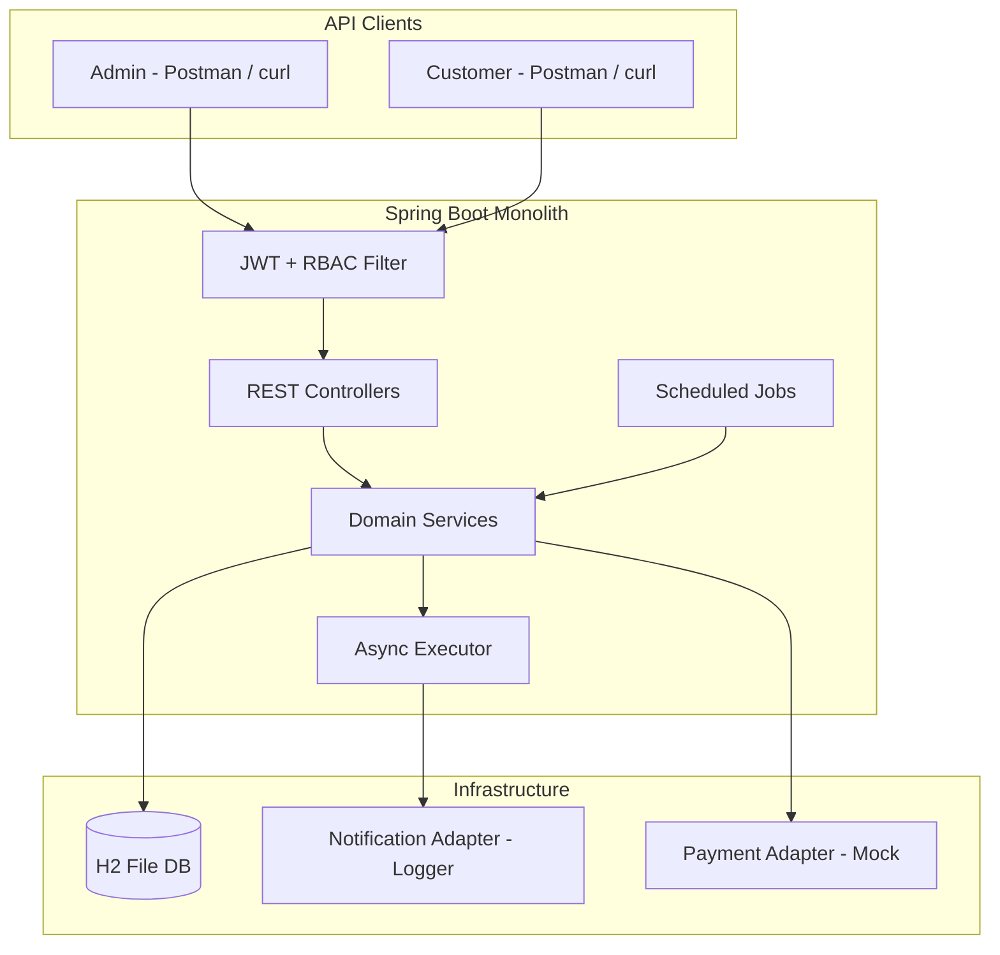
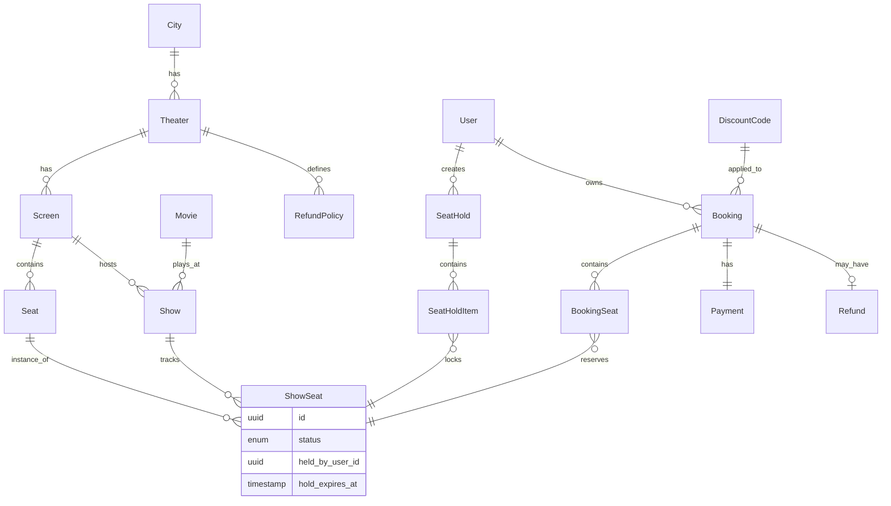
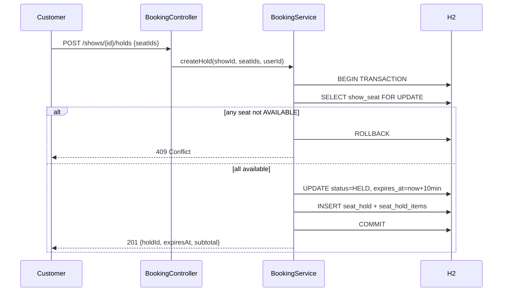
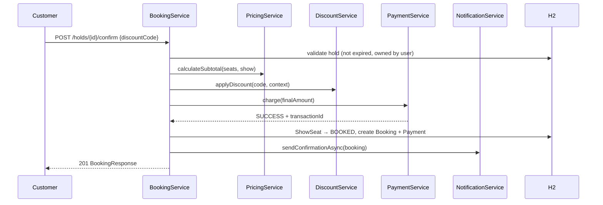
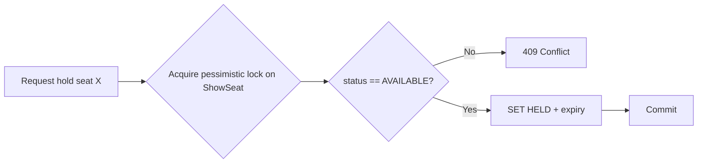
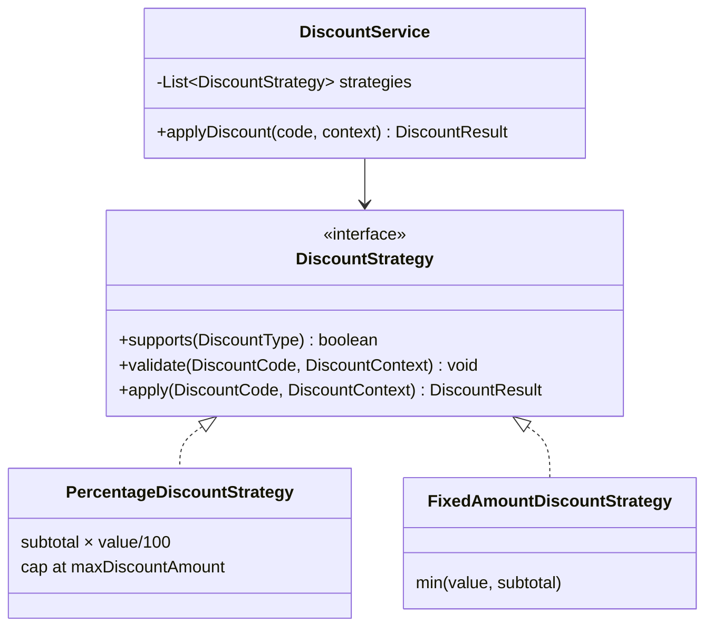
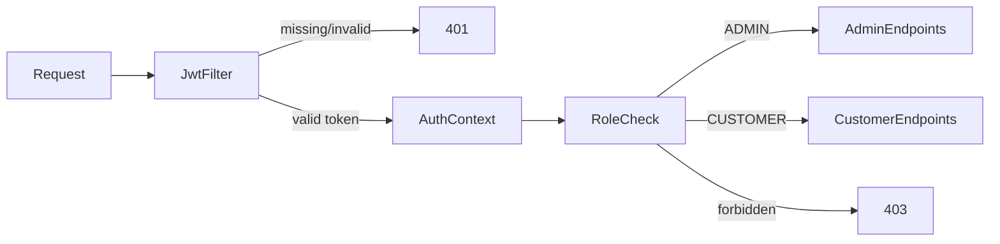

# Architecture

Detailed architecture for the Movie Ticket Booking System.

## System Context



## Layer Structure

| Layer | Responsibility |
|-------|----------------|
| **web** | HTTP endpoints, request/response DTOs, input validation |
| **service** | Business rules, transactions, orchestration |
| **repository** | Data access via Spring Data JPA |
| **domain** | Entities, enums, domain constants |
| **config** | Security, JWT, async thread pool, scheduling |
| **scheduler** | Hold expiry and show reminder jobs |
| **exception** | Global error handling, consistent API error format |

### Package layout

```
com.movieticket
├── MovieTicketApplication.java
├── config/
│   ├── SecurityConfig.java
│   ├── JwtConfig.java
│   ├── AsyncConfig.java
│   └── OpenApiConfig.java
├── domain/
│   ├── entity/          JPA entities
│   └── enums/           Role, SeatStatus, DiscountType, etc.
├── repository/
├── service/
│   ├── catalog/         City, Theater, Screen, Movie, Show
│   ├── booking/         Hold, confirm, cancel
│   ├── pricing/         PriceCalculator, DiscountService, strategies
│   ├── payment/         MockPaymentGateway
│   ├── refund/          RefundPolicyEngine
│   └── notification/    Async notification sender
├── web/
│   ├── controller/
│   ├── dto/
│   └── mapper/
├── exception/
└── scheduler/
    ├── HoldExpiryScheduler.java
    └── ShowReminderScheduler.java
```

## Entity Relationship



### ShowSeat — concurrency anchor

Every show gets one `ShowSeat` row per physical seat when the show is created. All hold and book operations lock and update these rows.

| Column | Purpose |
|--------|---------|
| `show_id`, `seat_id` | Unique inventory key |
| `status` | `AVAILABLE`, `HELD`, `BOOKED` |
| `held_by_user_id` | Current hold owner |
| `hold_expires_at` | TTL for auto-release |
| `seat_hold_id` | Link to active hold record |

## Core Flow Sequences

### Hold seats



### Confirm booking



### Hold expiry

```
HoldExpiryScheduler (every 30s)
  1. Find show_seat WHERE status=HELD AND hold_expires_at < NOW()
  2. SET status=AVAILABLE, clear hold fields
  3. UPDATE seat_hold SET status=EXPIRED
```

### Cancel and refund

```
POST /bookings/{id}/cancel
  1. Load booking + show + theater refund policy
  2. RefundPolicyEngine.compute(showStart, now) → refundAmount
  3. Create Refund record; update Payment status
  4. ShowSeat → AVAILABLE
  5. sendCancellationAsync(booking)
```

## Concurrency Design



| Mechanism | Detail |
|-----------|--------|
| Lock target | Individual `ShowSeat` rows |
| Lock mode | `PESSIMISTIC_WRITE` via `@Lock` |
| Guard | Conditional update + affected row count check |
| Constraint | `UNIQUE(show_id, seat_id)` |
| Transaction scope | One transaction per hold; one per confirm |

## Discount Strategy



### DiscountCode fields

| Field | Type | Notes |
|-------|------|-------|
| `code` | String | Unique identifier |
| `type` | DiscountType | `PERCENTAGE`, `FIXED_AMOUNT` |
| `value` | BigDecimal | 20 = 20% or currency units off |
| `maxDiscountAmount` | BigDecimal | Cap for percentage discounts |
| `minOrderAmount` | BigDecimal | Minimum subtotal to apply |
| `validFrom`, `validUntil` | Instant | Validity window |
| `maxUsageCount` | Integer | Optional global usage limit |
| `currentUsageCount` | Integer | Incremented on successful booking |
| `active` | boolean | Admin toggle |

### Extensibility

To add a new discount type:

1. Add enum value to `DiscountType`
2. Implement `DiscountStrategy`
3. Register as a Spring `@Component` — auto-wired into `DiscountService`

No changes required in `BookingService` or controllers.

## Pricing Rules

```
basePrice = seat.tier.basePrice (REGULAR or PREMIUM)
if show.startTime is weekend (Sat/Sun in city timezone):
    basePrice = basePrice × weekendMultiplier
subtotal = sum(basePrice for each seat)
discount = DiscountService.apply(code, subtotal)
finalAmount = subtotal - discount  (min 0)
```

## Refund Policy

Policies are defined per theater as ordered tiers:

| Hours before show | Refund % |
|-------------------|----------|
| \> 24 | 100 |
| 2 – 24 | 50 |
| \< 2 | 0 |

`RefundPolicyEngine` selects the matching tier based on `Duration.between(now, showStart)`.

## Security



- Registration creates `CUSTOMER` role only; admin users seeded via Flyway.
- JWT contains `userId`, `email`, `role`.
- Stateless sessions — no server-side session store.

## Notification Design

Notifications are **fire-and-forget** via `@Async`:

| Event | Trigger | Channel |
|-------|---------|---------|
| Booking confirmed | After successful payment | Mock (logged) |
| Show reminder | 2h before show start | Mock (logged) |
| Booking cancelled | After refund processed | Mock (logged) |

`NotificationLog` table records every sent notification for audit.

## Error Response Format

```json
{
  "timestamp": "2026-06-20T10:00:00Z",
  "status": 409,
  "error": "Conflict",
  "message": "Seat A5 is already held or booked",
  "path": "/api/v1/shows/abc/holds"
}
```

## Configuration

```yaml
app:
  booking:
    hold-duration-minutes: 10
  notification:
    reminder-hours-before: 2
  jwt:
    secret: ${JWT_SECRET:dev-secret-change-in-production}
    expiration-ms: 86400000
```

## Database

- **Engine:** H2 file-based (`./data/movieticket`)
- **Mode:** PostgreSQL compatibility
- **Schema management:** Flyway migrations only (`ddl-auto: validate`)
- **Rationale:** Zero external setup; schema portable to PostgreSQL
